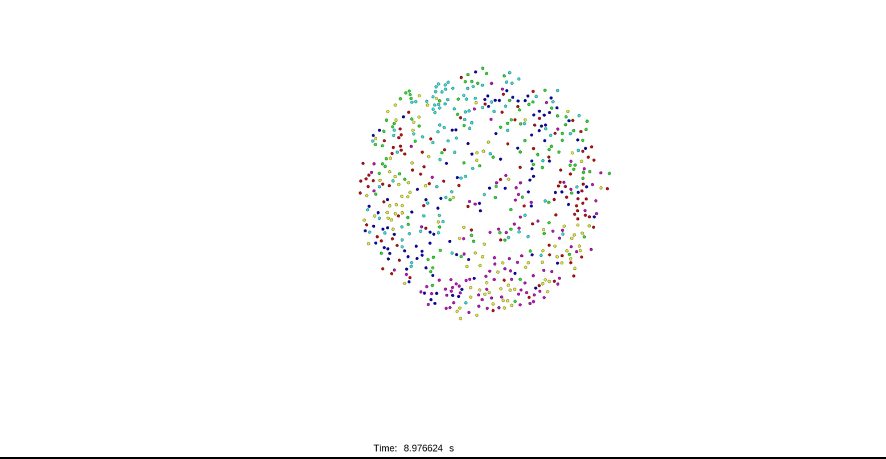
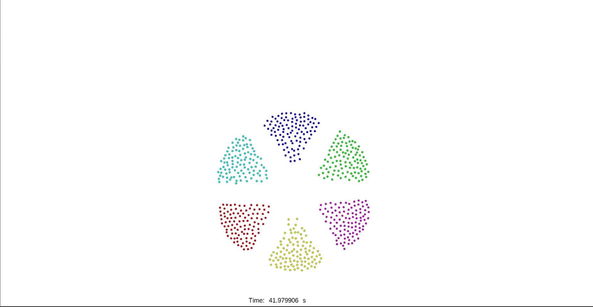

# SPH Multi-Swarm

A ROS-based multi-swarm simulation system using Smoothed Particle Hydrodynamics (SPH) for particle group formation and movement.

## Requirements

- **Operating System**: Ubuntu 20.04
- **ROS Distribution**: ROS Noetic

## Installation

### 1. Install ROS Noetic

You can use the following one-click installation script (tested in Mainland China; if it doesn't work in other regions, please leave an issue):

```bash
wget http://fishros.com/install -O fishros && sudo bash fishros
```

Alternatively, you can follow the official ROS Noetic installation guide: [ROS Noetic Installation](http://wiki.ros.org/noetic/Installation/Ubuntu)

### 2. Download and Build

Clone the repository:

```bash
git clone https://github.com/SmartGroupSystems/SPH_multi_swarm.git
```

Navigate to the workspace and build:

```bash
cd SPH_multi_swarm
catkin_make
```

If everything is configured correctly, the build should complete successfully.

## Usage

1. Source the setup file:

```bash
source devel/setup.bash
```

2. Launch the simulation:

```bash
roslaunch water_swarm sph_multi_swarm.launch
```

If everything is working correctly, you should see a visualization window similar to the following:


3. **Interact with the simulation**:
   - Use the **2D Nav Goal** tool in the visualization editor
   - Click on the white area to set a goal point (Note: This goal point is only used to trigger particle movement, not as an actual navigation target)
   - If everything is configured correctly, you will observe particles moving and forming different groups

The following images demonstrate the particle group formation process:







## Troubleshooting

If you encounter any issues during installation or usage, please feel free to contact us:

**Email**: ruochengli@bit.edu.cn


